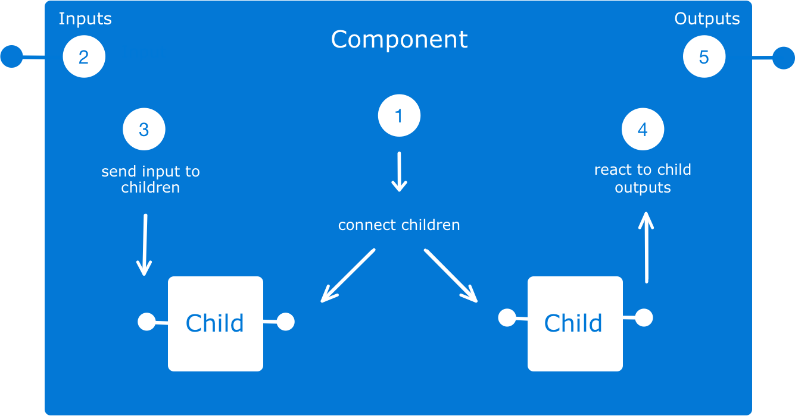

# The Component Pattern

The project is a collection of ideas around structuring software.
The component pattern is generally a pattern of understanding. It can be implemented or reasoned about in varying degrees mostly by convention using existing types you already know. The ideas here are not unique, in-fact you will recognize them as far back as the Unix OS, Lisp, and many other places.
 
 - [ ] TODO: compile a list of implementations.


What is a component?
--------------------
Components are based on the idea that software has three axis, **structure**, **behavior**, and **state** and each are interdependent to make a coherent well organized system. A component provides structure, and is defined as any composable type that has input, a process(behavior), and output. Another way to think about a component is a pure function with as set of possible inputs and a set of possible outputs.


Composition:
------------
- [ ] TODO




The significance of an output.
------------------------------
When asked about the meaning of Object Oriented Programming Alan Kay once said:

>> *"OOP to me means only messaging, local retention and protection and
 hiding of state-process, and extreme late-binding of all things"*

What is wrong with messaging in common OOP is that objects communicate across their boundaries and only at the request of the receiver. A receiver has to ask another object for it's state when it needs it. The source of facts sends the state back to caller at the time of request, not at the time of truth. Software is a process so any recorded data in the system is potentially suspect. It's a slice in time. Therefore we are trying to make a process by time slicing back in time often using past truths that may or may not be in sync, hoping that facts are correct. We end up writing paranoid software, locking around data inside of our object because you never know when another thread is going to come along and access this data. To me, this is insanity!

  Messaging in the component pattern is about communicating facts as they are true along what I call a "plane of truth". Asynchronicity happens on a perpendicular plane of truth. All messaging is co-ordinated from a focal point of reasoning. (#1 in the above)

To that end what is important are the following:

1. The existence of an output in context of some structure. (components) delivered as facts occur.
2. The intention of the receiver to receive that output as facts occur.

Public methods and properties do not provide these, and is why components have outputs.


**_Isn't an output an observable?_**

Yes, sort of. The observable pattern focuses on _values over time_ but I believe that the higher order idea is the idea of _a value at some point in time._ and in context. Facts are useless without context. If I said "42" you have no idea what that means. But if I say the "thermometer output 42" it has meaning. Here we have structure, behavior, and state.

This is the significance of a component output, it coerces proper system semantics with constraints.

**Side note:**
 I believe a pattern smell is when a software system is made of parts that have obscure abstract names that are nothing about the solution. Names like presenters, interactors, or routers for example.

# Simple Components: Operators
Operators are simple components that compose together to make new ones. They take a single input, and may produce output, or, not. The not part is important. It's not that operations do or don't output, they may or may not, depending on context and purpose. For example a filter operator.

**The idea behind operators are simple:**

- a useful abstraction is "as much process with as little content as possible".
- processing a value should not be coupled to it's delivery method. (such as observable operators)

```swift
/// A type that operates on values possibly producing a different type,
/// or no value at all.
public protocol OperatorProtocol {
    associatedtype Input
    associatedtype Output
    
    /// Operates and produces the next value with the specified input.
    mutating func input(_ input: Input) -> Output?
    
    /// Composes a target operator with `self` and returns a new operator.
    func compose<Target:OperatorProtocol>(_ : Target) -> Operator<Input, Target.Output> where Target.Input == Output
}
```

```swift
var myOperator = Take<MyStruct>().map{ format($0.myProperty) }.action { label.text = $0 }
```
We start with `Take` to declare we want to input values of type`MyStruct`, we then perform a `map` and an `action`.  This defines `myOperator`, a new `operator`. Now we have a distinct purposeful operation component we can input values into and produce a result.

```swift

myOperator.input(myStruct) 

```

**Example Operators**

| `Operator`         | Description                                                                            |
|--------------------|----------------------------------------------------------------------------------------|
| `Take`          | Produces it's input                                                                    |
| `Limit`         | Produces it's input a limited number of times                                          |
| `Distinct`         | Produces distinct values relative to it's last output                                  |
| `Discard`          | Produces Void regardless of input                                                      |
| `Action`           | Performs an action with  and produces it's input                            |
| `Map`              | Produces the result of mapping a function over it's input                              |
| `Filter`           | Produces output that satisfies a predicate                                             |
| `Reduce`           | Produces the result of calling a `combine` function on each input and the last combine |
| `Produce`           | Produces a result from a producer function |
| `Count`            | Produces a count of it's input                                                         |
| `Branch`           | Branch with the current output, then continue on the main branch                       |
| `Combine`          | Combines it's input with the output of an operator producing a tuple      |
| `.print`            | Prints and produces it's input                                                             |
| `.description`      | Produces inputs description                                                            |
| `.debugDescription` | Produces the inputs debug description                                                  |
| `.prefix`           | Prefix the string input with a string                                                  |
| `.date`             | Produce a tuple with the input and a date                                              |
| `.defaultTo`             | Produce a default value if the no output is produced                              |
